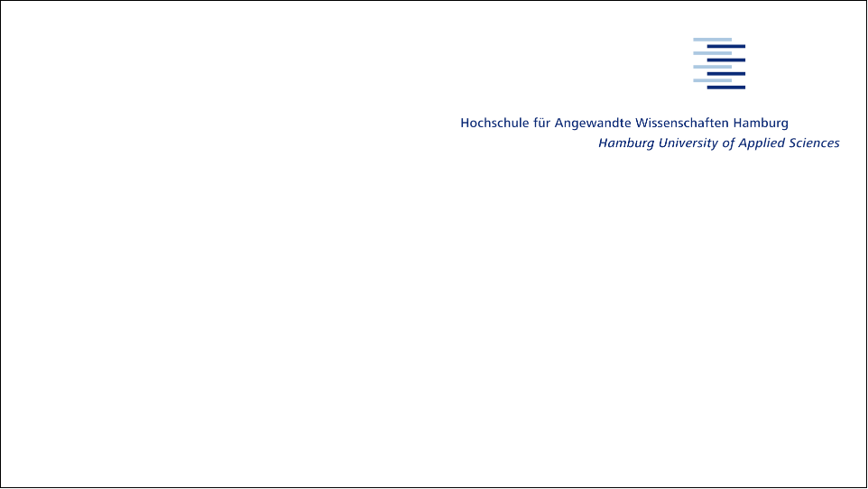
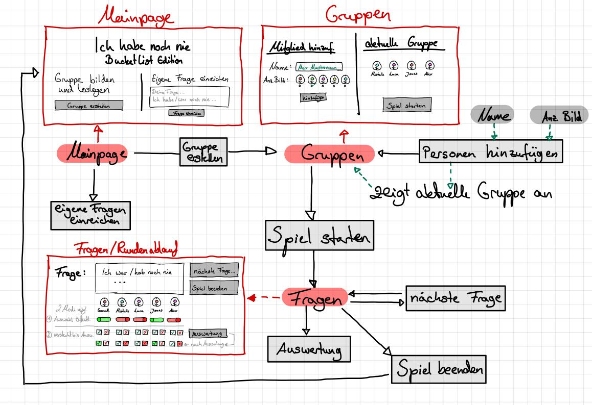
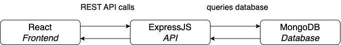
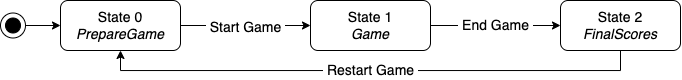

<!-- presenter notes als HTML kommentare -->

---

## Team 5

Sören Helms (2359614), Engin Arslan (2239408), 
Jannik Hoefener (2574970), Nico Bielat (2529235)

---

## Gliederung

1. Idee
2. Lastenheft
3. Umsetzung & Architektur
4. Tests
5. Automation & Deployment
6. Organisation & Kommunikation
7. Aussicht & Reflexion

---

## Idee

...

---

## Lastenheft

---

## Architektur: Technologien

- Frontend: React, TypeScript, Node.js
- API statt Backend: ExpressJS, MongoDB
- CI/CD mit GitHub Actions
- Docker

---

## Architektur: Kommunikation

---

## Architektur: State Machine

---

<!-- den rest bitte hier nachschauen:
[marp-cli-example](https://github.com/yhatt/marp-cli-example)
-->
