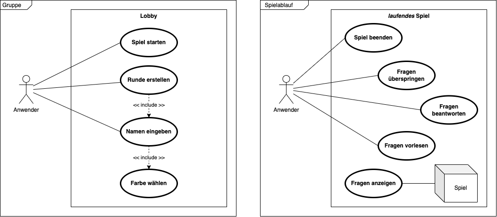
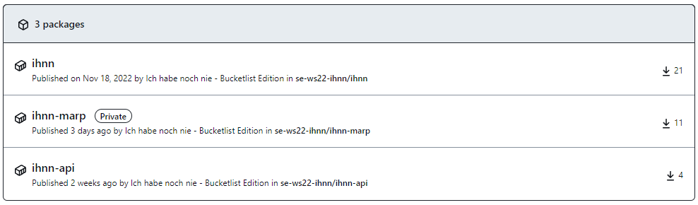

<!-- presenter notes als HTML kommentare -->

---

## Team 5

Sören Helms (2359614), Engin Arslan (2239408), 
Jannik Hoefener (2574970), Nico Bielat (2529235)

---

## Gliederung

1. Idee
2. Anforderung & Planung
3. Umsetzung & Architektur
4. Testing
5. Automation & Deployment
6. Organisation & Kommunikation
7. Aussicht & Reflexion

<!-- Nico -->
---

## Idee

- basiert auf dem Spiel "Ich habe noch nie"
- Themenbereich Bucket List
- Ideal auf dem Smartphone spielbar
- Flexible Gruppengröße

<!-- Die Idee neu übertragen, Uni-freundliches Thema, -->

<!-- Nico -->

---

## Ermittlung der Anforderungen

<!-- Mockup der ersten Stunde -->

<!-- Jannik -->
<!-- - Idee erster Ansatz -->
<!-- - Brainstorming Resultat: Mindmap mit MockUps -->
<!-- - 3 Phasen -->

---

## Use Case Diagramme

<!-- Jannik -->
<!-- - Gruppe erstellen -->
<!-- - Spielablauf verwalten -->

---

## Architektur: Technologien

* Frontend: React, TypeScript, Node.js
* API statt Backend: ExpressJS, MongoDB
* Deployment mit GitHub Actions
* Docker

<!-- one by one durchgehen -->

<!-- Jannik -->
<!-- - NPM => MaterialUI, Formik, Yup -->
<!-- -  -->

---

## Architektur: Kommunikation

 

<!-- Jannik -->
<!-- Kommunikation FE zu API, API zu DB -->
<!-- API wird später von Sören näher erklärt -->

---

## State Machine

 

<!-- Jannik -->
<!-- - App-Ablauf in Zuständen: 3 Phasen wie im MockUp -->
<!-- - State erhöhung durch OnClick Funktion bei best. Knöpfen -->
<!-- - Durch % Ausbruch verhindert -->

---

## Komponenten

<!-- Jannik -->
<!-- - Verschachtlung / Abhängigkeit der Komponenten -->
<!-- - Haupt-Komponente aus versch. anderen Komp. -->

---

### Aktivitätsdiagramm

<!-- Jannik -->
<!-- - Verbindet Logik StateMachine & Ablauf aus sicht des Nutzer -->
<!-- - Quasi Umsetzung der Mindmap/MockUp  -->

---

## Architektur: MVC

<!-- Jannik -->
<!-- vereinf. Darstellung => da kein Backend -->
<!-- Nur Views die mit Model und Controller "kommunizieren" -->

<!-- Nun Life Demo von Nico -->

---

## Live Demo

 

<!-- in die Live Demo wechseln -->

<!-- Nico -->

---

## Live Demo API

 

<!-- in die Live Demo wechseln -->

<!-- Sören -->

---

## Testing

* Live Konsolen Ausgabe
* Eigenes Testing
* Code Review
* PageSpeed Insights
* Feedback

<!-- one by one -->
<!-- der Docker Build ist natürlich auch eine Art test, baut es nicht, wird gar nicht erst deployed... -->

<!-- Engin -->

---

## Automation

- Alles in Docker Containern
- Workflows für jedes Repository
- Deployment mit GitHub Actions

<!-- alle Teile des Projekts; Code, Doku und Präsi werden gebaut und ausgeliefert -->

<!-- Sören -->

---

## Deployment

- Ende der Pipeline löst Redeploy aus
- 5 Min. von Commit bis Deploy ausgeführt
- optimiert auf geringe Image Größe

<!-- oft sogar schneller -->
<!-- Sören -->

---

## Organisation & Kommunikation

- GitHub Issues & Projects (KanBan)
- Teams Besprechungen

<!-- darlegen das wasserfall eher suboptimal lief, da alles auf zwei Meilensteine aufgeteilt wurde; das eher aber auch wegen des fatalen Zeitmanagements -->

<!-- Engin -->

---

## Aufgabenverteilung

##### Verteilung nach Vorerfahrung und Interesse

| Person | Aufgabe |
|:--- |:--- |
| Sören | Frontend &bull; API &bull; Doku &bull; Deploy |
| Jannik | Frontend &bull; API &bull; Doku &bull; Präsentation |
| Engin | Testing &bull; Datenmodell |
| Nico | Design &bull; Präsentation |

<!-- Engin -->

---

## Aussicht & Reflexion

- Weiterentwicklung möglich
- Rewrite notwendig
- Bessere Zeitplanung & Kommunikation

<!-- Nach einem Rewrite könnten neue Funktionen einfach als weitere Komponenten eingebaut werden -->
<!-- bessere Worte für den Review finden -->

<!-- Nico -->

---

<!-- _footer: "" -->

<!-- Sören -->

---

## Fragen?

<!-- Entsprechend des Ressort -->

---

## Selber spielen?

<!-- QR Code damit die Leute sich das dann auch selbst anschauen können -->

---

## Vielen Dank für die Aufmerksamkeit

--

#### Quellen

Alle Diagramme, sowie die Grafiken für unsere App sind selbst erstellt. Logos von Technologien gehören ihren jeweiligen Eigentümern.

<!-- den rest bitte hier nachschauen:
[marp-cli-example](https://github.com/yhatt/marp-cli-example)
-->
