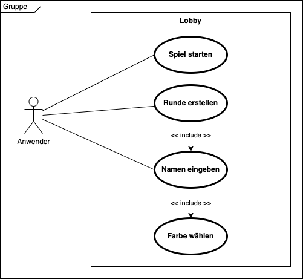
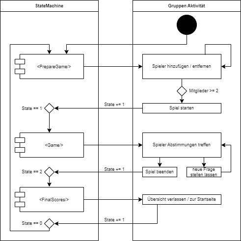
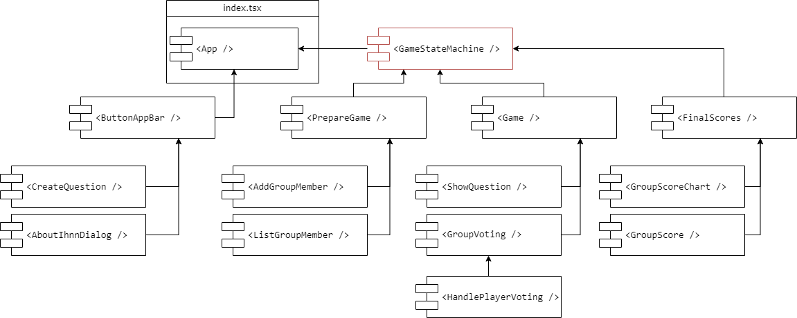
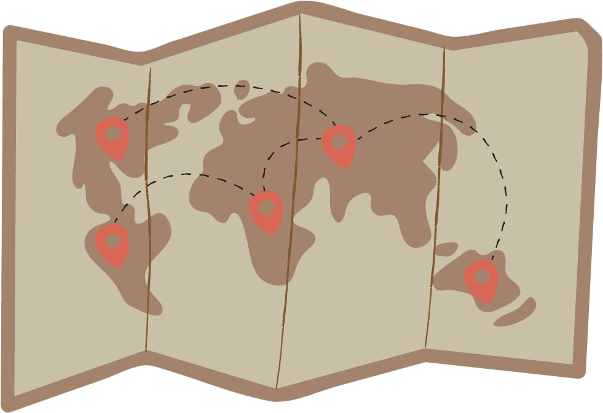

<!-- presenter notes als HTML kommentare -->

---

## Team 5

Sören Helms (2359614), Engin Arslan (2239408), 
Jannik Hoefener (2574970), Nico Bielat (2529235)

---

## Gliederung

1. Idee
2. Lastenheft ? Planung?
3. Umsetzung & Architektur
4. Testing
5. Automation & Deployment
6. Organisation & Kommunikation
7. Aussicht & Reflexion

---

## Idee

- basiert auf dem Spiel "Ich habe noch nie"
- Themenbereich Bucket List
- Ideal auf dem Smartphone spielbar
- Flexible Gruppengröße

<!-- Die Idee neu übertragen, Uni-freundliches Thema, -->

---

## Lastenheft

<!-- Mockup der ersten Stunde -->

---

## Use Case: Spiel vorbereiten

<!-- gute wahl? -->

---

## Architektur: Technologien

* Frontend: React, TypeScript, Node.js
* API statt Backend: ExpressJS, MongoDB
* CI/CD mit GitHub Actions
* Docker

<!-- one by one durchgehen -->

---

## Architektur: Kommunikation

 

<!-- Kommunikation FE zu API, API zu DB -->
<!-- hier vllt auch kurz auf die API eingehen und die Doku in der Live Demo zeigen -->

---

## Architektur: State Machine

 

<!-- Spielablauf in drei Phasen als State Machine, danach folgt das Aktivitätsd. -->

---

### Aktivitätsdiagramm

---

## Architektur: Komponenten

<!-- Der Aufbau der App gesehen in Komponenten, die teils neue Komponenten bilden -->

---

## Architektur: MVC

<!-- vereinfachte Darstellung, da wir kein Backend haben. Nur Views die auch M und C haben dargestellt -->

---

## Live Demo

<!-- in die Live Demo wechseln -->

<!-- auch die API Doku zeigen? -->

---

## Try Yourself

<!-- QR Code damit die Leute sich das dann auch selbst anschauen können -->

---

## Testing

* Live Konsolen Ausgabe
* Eigenes Testing
* Code Review
* PageSpeed Insights
* Feedback

<!-- one by one -->

---

## Automation

- Alles in Docker Containern
- Workflows für jedes Repository
- Deployment mit GitHub Actions

<!-- alle Teile des Projekts; Code, Doku und Präsi werden gebaut und ausgeliefert -->

---

## Deployment

- Ende der Pipeline löst Redeploy aus
- 5 Min. von Commit bis Deploy ausgeführt
- optimiert auf geringe Image Größe

<!-- oft sogar schneller -->

---

## Organisation & Kommunikation

- GitHub Issues & Projects
- Teams Besprechungen
- Wasserfall-Modell pro Meilenstein

<!-- darlegen das wasserfall eher suboptimal lief, da alles auf zwei Meilensteine aufgeteilt wurde; das eher aber auch wegen des fatalen Zeitmanagements -->

---

## Aussicht & Reflexion

- Weiterentwicklung möglich
- Rewrite notwendig
- Bessere Zeitplanung

<!-- Nach einem Rewrite könnten neue Funktionen einfach als weitere Komponenten eingebaut werden -->
<!-- bessere Worte für den Review finden -->

---

# idee ?

---

## Fragen?

---

## Vielen Dank für die Aufmerksamkeit

--

#### Quellen

Alle Diagramme, sowie die Grafiken für unsere App sind selbst erstellt. Logos von Technologien gehören ihren jeweiligen Eigentümern.

<!-- den rest bitte hier nachschauen:
[marp-cli-example](https://github.com/yhatt/marp-cli-example)
-->
